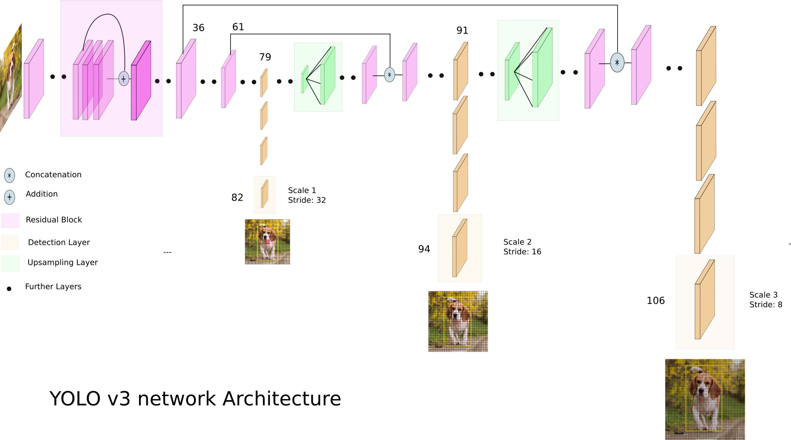

# face-detection-yolov3-keras

## Overview of the project


The YOLOv3 (You Only Look Once) is a state-of-the-art, real-time object detection algorithm. The published model recognizes 80 different objects in images and videos. For more details, you can refer to this [paper](https://pjreddie.com/media/files/papers/YOLOv3.pdf).
The official [DarkNet GitHub](https://github.com/pjreddie/darknet) repository contains the source code for the YOLO versions mentioned in the papers, written in C. The repository provides a step-by-step tutorial on how to use the code for object detection.
Instead of developing this code from scratch, we can use a third-party implementation. There are many third-party implementations designed for using YOLO with Keras.

The basic steps follwed were
* For making the model the pre trained wight file which is trained on the [WIDER FACE: A Face Detection Benchmark](http://mmlab.ie.cuhk.edu.hk/projects/WIDERFace/index.html) dataset from this [link](https://drive.google.com/file/d/1xYasjU52whXMLT5MtF7RCPQkV66993oR/view?usp=sharing) was used.
* Write a Keras model that has the right number and type of layers to match the downloaded model weights. The model architecture is called a [“DarkNet”](https://github.com/pjreddie/darknet/blob/master/cfg/yolov3.cfg) and was originally loosely based on the VGG-16 model.
* Change the number of filters in the yolo layers to make it a classifier for single class detction, i.e. face.
* Build the model bby loading the model weights using the previously downloaded pretrained weights
* Perform the prediction.

## YOLOv3's architecture



Credit: [Ayoosh Kathuria](https://towardsdatascience.com/yolo-v3-object-detection-53fb7d3bfe6b)

https://github.com/experiencor/keras-yolo3/blob/master/yolo3_one_file_to_detect_them_all.py


## Model Design and Implementation


## Implement this project

### Prerequisites

* Tensorflow
* opencv-python
* Numpy
* Keras
* Matplotlib
* Pillow

### I. Setting up [miniconda](https://conda.io/en/latest/):

**Install** [miniconda](http://conda.pydata.org/miniconda.html) on your machine. Detailed instructions:

- **Linux:** http://conda.pydata.org/docs/install/quick.html#linux-miniconda-install
- **Mac:** http://conda.pydata.org/docs/install/quick.html#os-x-miniconda-install
- **Windows:** http://conda.pydata.org/docs/install/quick.html#windows-miniconda-install

**Clone** the repository. 
```sh
git clone https://github.com/chinmaykumar06/face-detection-yolov3-keras.git
```

**Move into the cloned repository**
```
cd face-detection-yolov3-keras
```

**Create** my_project_env.  Running this command will create a new `conda` environment named my_project_env.
```
conda create --name my_project_env python =3.7
```

**Download** the dependencies.  Running this command will download the dependencies and libraries in the created environment.
```
pip install -r requirements.txt
````

**Verify** that the environment was created in your environments:
```sh
conda info --envs
```
**If you think some error happend while performing the above process you can clean up the libraries and uninstall athe environment and try again!**

**Cleanup** downloaded libraries (remove tarballs, zip files, etc):
```sh
conda clean -tp
```

**Uninstalling**
To uninstall the environment:
```sh
conda remove --name my_project_env --all
```

**Once you are sure that your environment is installed properly,**

**Activate** the enoviornment.  Running this command will activate the created environment where you can install the dependencies.
`````
conda activate my_project_env
`````
* For face detection, you should download the pre-trained YOLOv3 weights file which trained on the [WIDER FACE: A Face Detection Benchmark](http://mmlab.ie.cuhk.edu.hk/projects/WIDERFace/index.html) dataset from this [link](https://drive.google.com/file/d/1xYasjU52whXMLT5MtF7RCPQkV66993oR/view?usp=sharing) and place it in the cloned repository

* Run the following command:

>**building the model**
```bash
$ python yoloface.py 
```
Upon running this command a model.h5 file should appear in your working directory which is the keras model-architecture with the pre trained weights that were downloaded

>**image input**
```bash
$ python face-detection.py --image samples/test.jpg --output-dir outputs/
```
(for testing the model against your input add the images to the samples/ folder and run the command with the respective input name)

To exit the environment when you have completed your work session, simply close the terminal window.

### II. Setting up Google Colab
The repository consists of the jupyter notebooks of the code as well they can be easily implmented in colasb or even on your local machine, the steps to run it on colab are given below:
1. Open https://colab.research.google.com, click **Sign in** in the upper right corner, use your Google credentials to sign in.
2. Click **GITHUB** tab, paste https://github.com/chinmaykumar06/face-detection-yolov3-keras.git and press Enter
3. This repository will get cloned in your Drive in the folder Colab Notebooks
4. Download the weights file from the [link](https://drive.google.com/file/d/1xYasjU52whXMLT5MtF7RCPQkV66993oR/view?usp=sharing) and add it to the cloned directory.
5. Go to the directory and open **yolov3.ipynb** using Colab.
6. Now mount your drive and using cd change your path to the cloned repository.
7. Run all the code blocks and at the end you will finish building the model with the pretrained weights and a model.h5 file will be saved to your cloned repo.
8. Now open the **face-detection.ipynb** file as another colab noteboook. Make sure the drive is mounted and your path is set to the cloned repository.
9. Now run the cells of the notebook one by one. However you will not get the output then and there since in colab cv2.imshow doesn't work hence you can later read those files using matplotlib and see the output or directly see it in the outputs/ folder where the outputs are saved.
10. The images for which the face detection has to be performed needs to be added to the samples/ folder and accordingly the filename needs to be changed in the codeblocks.

## Sample outputs

### Face detection


### After blurring the background


